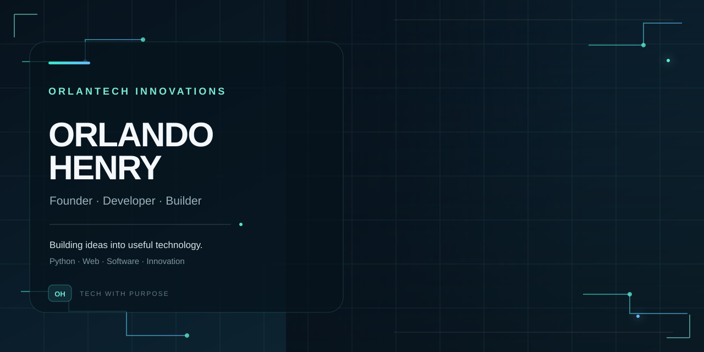

<p align="center">
  
</p>

<br>

<h1 align="center">Hey, I'm Orlando Henry 👋</h1>

<p align="center">
  <strong>Founder · Developer · Builder</strong>
</p>

<p align="center">
  Where Tech Meets Creativity and Passion
</p>

<p align="center">
  <a href="#-about-me">About</a> •
  <a href="#-what-i-build">What I Build</a> •
  <a href="#-technology">Technology</a> •
  <a href="#-orlan-tech-innovations">ORLANTECH</a> •
  <a href="#-lets-connect">Connect</a>
</p>

---

## 👨🏽‍💻 About Me

I'm **Orlando Henry**, a developer and technology enthusiast with a passion for turning ideas into practical digital solutions.

I enjoy exploring how technology works, building things from scratch, solving problems with code, and constantly learning something new along the way.

I'm particularly interested in **Python, web development, software engineering, automation, and technology-driven ideas**.

> **Build. Learn. Improve. Repeat.**

---

## 🚀 What I Build

I like working on projects that sit somewhere between **technology, creativity, and real-world usefulness**.

```text
┌─────────────────────────────────────────────┐
│                                             │
│   💻  Web Applications                      │
│   🐍  Python Projects                       │
│   ⚙️  Software & Automation                 │
│   🧠  Problem Solving                       │
│   💡  Experimental Projects                 │
│   🚀  Digital Products                      │
│                                             │
└─────────────────────────────────────────────┘
```

I'm not interested in simply writing code that works.

**I want to understand it, improve it, and build something meaningful with it.**

---

## 🛠️ Technology

<p align="center">


</p>

### Currently exploring

* 🐍 Python & backend development
* 🌐 Modern web development
* 🗄️ Databases & data-driven applications
* ⚙️ Automation and scripting
* 🧩 Software architecture
* 🚀 Building and shipping real projects

---

## 🏢 ORLANTECH INNOVATIONS

<p align="center">
  <strong>Technology • Creativity • Innovation</strong>
</p>

**ORLANTECH INNOVATIONS** is my personal technology venture focused on creating digital solutions, experimenting with ideas, and exploring the possibilities of technology.

The goal is simple:

> **Use technology to turn good ideas into useful things.**

This GitHub profile is part of that journey — a place where I experiment, build, learn, and document the things I'm working on.

---

## 📌 Featured Work

Some projects are experiments.

Some solve problems.

Some start as random ideas at 2 AM.

**All of them are part of the learning process.**

Check out my repositories to see what I'm currently building.

<p align="center">
  <a href="https://github.com/ORLAND0HENRY">
    
  </a>
</p>

---

## 📊 GitHub

<p align="center">
  
  
</p>

---

## 🌱 The Journey

I'm still learning.

Still experimenting.

Still breaking things.

Still fixing them.

And that's exactly how I like it.

Every project teaches me something new, and every problem is another opportunity to understand technology a little better.

```text
                    KEEP BUILDING
                         │
              ┌──────────┼──────────┐
              ▼          ▼          ▼
            LEARN      BUILD      IMPROVE
              │          │          │
              └──────────┼──────────┘
                         │
                         ▼
                      REPEAT
```

---

## 🤝 Let's Connect

Whether you're a developer, creator, entrepreneur, tech enthusiast, or simply someone who likes building interesting things — you're welcome here.

<p align="center">
  <a href="https://github.com/ORLANTECH-INNOVATIONS">
    
  </a>
</p>

---

<p align="center">
  <sub>Designed, built & continuously improved by <strong>Orlando Henry</strong>.</sub>
</p>

<p align="center">
  <strong>ORLANTECH INNOVATIONS</strong>
  <br>
  <sub>Where tech meet creativity and passion</sub>
</p>
